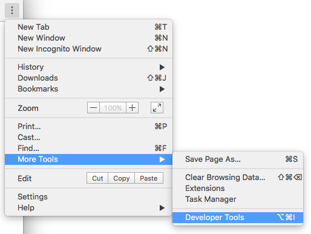
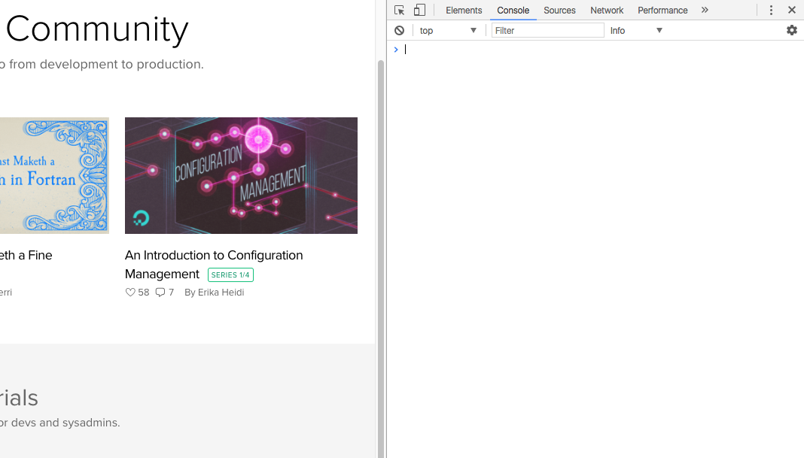
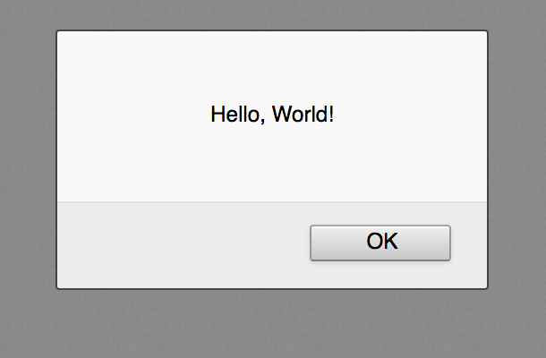
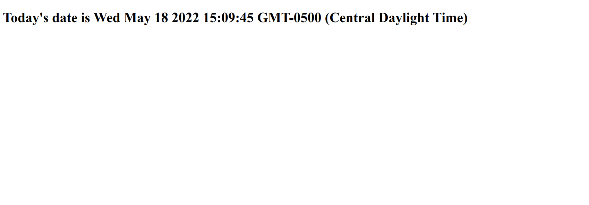
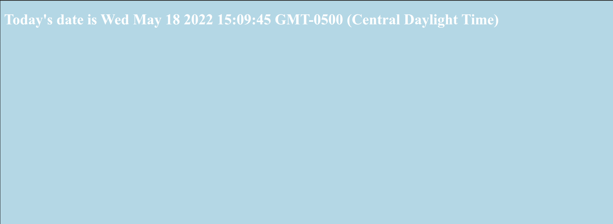
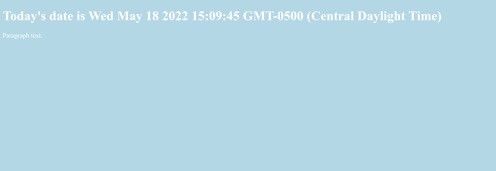
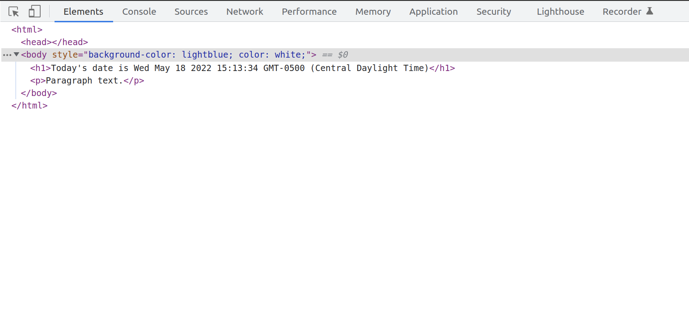
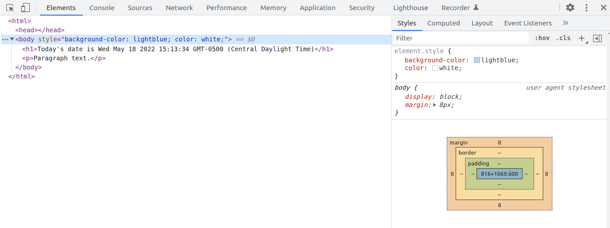

# Cómo utilizar la consola para desarrolladores de JavaScript

:::info
La fuente original (en ingles) de este tutorial se encuentra [aquí](https://www.digitalocean.com/community/tutorials/how-to-use-the-javascript-developer-console)
:::


## Introducción

Los navegadores modernos tienen herramientas de desarrollo integradas para trabajar con JavaScript y otras tecnologías web. Estas herramientas incluyen la Consola, que es similar a una interfaz de shell, junto con herramientas para inspeccionar el DOM, depurar y analizar la actividad de la red.

La Consola se puede utilizar para registrar información como parte del proceso de desarrollo de JavaScript, así como también permitirle interactuar con una página web ejecutando expresiones JavaScript dentro del contexto de la página. Básicamente, la Consola le brinda la capacidad de escribir, administrar y monitorear JavaScript a pedido.

Este tutorial explicará cómo trabajar con la consola y JavaScript en el contexto de un navegador y brindará una descripción general de otras herramientas de desarrollo integradas que puede utilizar como parte de su proceso de desarrollo web.

:::tip Nota
A medida que siga este tutorial, puede notar que su navegador y la Consola se ven diferentes a los ejemplos de las imágenes. Los navegadores se actualizan con frecuencia y suelen incluir nuevas herramientas y posiblemente un nuevo estilo visual. Estas actualizaciones no deberían afectar su capacidad para utilizar la Consola en el navegador.
:::

## Trabajar con la Consola en un Navegador

La mayoría de los navegadores web modernos que admiten HTML y XHTML basados en estándares le brindarán acceso a una Consola de desarrollador donde podrá trabajar con JavaScript en una interfaz similar a una terminal. Esta sección describe cómo acceder a la consola en Firefox y Chrome.

## Firefox

Para abrir [Web Console](https://firefox-source-docs.mozilla.org/devtools-user/web_console/index.html) en FireFox, navegue hasta el menú ☰ en la esquina superior derecha junto a la barra de direcciones.

Seleccione **More Tools**. Con eso abierto, haga clic en el elemento **Web Developer Tools**.


También puedes ingresar a la Consola Web con el atajo de teclado `CTRL` + `SHIFT` + `K` en Linux y Windows, o `COMMAND` + `OPTION` + `K` en macOS.

Ahora que ha accedido a la Consola, puede comenzar a trabajar en ella en JavaScript.

## Chrome

Para abrir la [Consola JavaScript](https://developer.chrome.com/docs/devtools/console/) en Chrome, puede navegar hasta el menú en la parte superior derecha de la ventana de su navegador, indicado por tres puntos verticales. Desde allí, puede seleccionar **More Tools** y luego **Developer Tools**.



Esto abrirá un panel donde puede hacer clic en **Console** en la barra de menú superior para abrir la Consola JavaScript si aún no está resaltada:



También puede ingresar a la Consola JavaScript usando el método abreviado de teclado `CTRL` + `SHIFT` + `J` en Linux o Windows, o `COMMAND` + `OPTION` + `J` en macOS, lo que traerá el foco inmediatamente a la Consola.

Ahora que ha accedido a la Consola, puede comenzar a trabajar en ella en JavaScript.

## Trabajando en la Consola

Dentro de la Consola, puede escribir y ejecutar código JavaScript.

Comience con una alerta que imprima la cadena `Hello, World!`:

```js
>> alert("Hello, World!");
```

Una vez que presione la tecla `ENTER` siguiendo su línea de JavaScript, aparecerá una ventana emergente de alerta en su navegador:



Tenga en cuenta que la consola también imprimirá el resultado de evaluar una expresión, que se leerá como `undefined` cuando la expresión no devuelva algo explícitamente.

En lugar de tener alertas emergentes de las que necesita hacer clic, puede trabajar con JavaScript registrándolo en la consola con `console.log`.

Para imprimir la cadena de `Hello, World!`, escriba lo siguiente en la Consola:

```js
>> console.log("Hello, World!");
```

Dentro de la consola, recibirá el siguiente resultado:

```sh
Output
Hello, World!
```

También puedes realizar cálculos en la Consola:

```js
>> console.log(2 + 6);
```

```sh
Output
8
```

También puedes probar algunas matemáticas más complicadas:

```js
console.log(34348.2342343403285953845 * 4310.23409128534);
```

```sh
Output
148048930.17230788
```

Además, puedes trabajar en varias líneas con variables:

```sh
>> let today = new Date();
>> console.log("Today's date is " + today);
```

```sh
Output
Today's date is Wed May 18 2022 15:06:51 GMT-0500 (Central Daylight Time)
```

Si necesita modificar un comando que pasó a través de la consola, puede escribir la tecla de flecha hacia arriba ( ↑ ) en su teclado para recuperar el comando anterior. Esto le permitirá editar el comando y enviarlo nuevamente.

La consola JavaScript le proporciona un espacio para probar el código JavaScript en tiempo real al permitirle utilizar un entorno similar a una interfaz shell de terminal.

## Trabajar con un Archivo HTML

Puede trabajar dentro del contexto de un archivo HTML o una página renderizada dinámicamente en la Consola. Esto le brinda la oportunidad de experimentar con código JavaScript dentro del contexto de HTML, CSS y JavaScript existentes.

Tenga en cuenta que tan pronto como vuelva a cargar una página después de modificarla dentro de la Consola, volverá a su estado anterior a la modificación del documento. Asegúrese de guardar cualquier cambio que desee conservar en otro lugar.

Tome un documento HTML, como el siguiente archivo `index.html`, para comprender cómo utilizar la consola para modificarlo. En su editor de texto favorito, cree un archivo `index.html` y agregue las siguientes líneas de HTML:


📃./index.html
```html
<!DOCTYPE html>
<html lang="en-US">

<head>
    <meta charset="UTF-8">
    <meta name="viewport" content="width=device-width, initial-scale=1">
    <title>Today's Date</title>
</head>

<body>

</body>

</html>
```

Si guarda el archivo HTML anterior y lo carga en el navegador de su elección, se mostrará una página en blanco con el título `Today's Date` en el navegador.

Abra la consola y comience a trabajar con JavaScript para modificar la página. Comience usando JavaScript para insertar un encabezado en el HTML.


```js
>> let today = new Date();
>> document.body.innerHTML = "<h1>Today's date is " + today + "</h1>"
```

Recibirá el siguiente resultado en la consola:

```sh
Output
"<h1>Today's date is Wed May 18 2022 15:06:51 GMT-0500 (Central Daylight Time)</h1>"
```

Su página debería ser similar a la siguiente:




Puedes modificar el estilo de la página, como el color de fondo:


```js
>> document.body.style.backgroundColor = "lightblue";
```

```sh
Output
"lightblue"
```

Así como el color del texto de la página:

```js
>> document.body.style.color = "white";
```

```sh
Output
"white"
```

Ahora su página debería revelar algo similar a esto:




Desde aquí, puedes crear un elemento de párrafo `<p>`:


```js
>> let p = document.createElement("P");
```

Una vez creado este elemento, puede continuar y crear un nodo de texto que se puede agregar al párrafo:

```js
>> let t = document.createTextNode("Paragraph text.");
```

Agregue el nodo de texto agregándolo a la variable `p`:


```js
>> p.appendChild(t);
```

Y finalmente agregue `p` con su elemento de párrafo `<p>` y el nodo de texto agregado al documento:


```js
document.body.appendChild(p);
```

Una vez que haya completado estos pasos, su página HTML `index.html` incluirá los siguientes elementos:




La Consola le proporciona un espacio para experimentar con la modificación de páginas HTML, pero es importante tener en cuenta que no está cambiando el documento HTML en sí cuando hace cosas en la Consola. Una vez que vuelva a cargar la página, volverá a ser un documento en blanco.


## Comprender Otras Herramientas de Ddesarrollo

Dependiendo de las herramientas de desarrollo del navegador que utilice, podrá utilizar otras herramientas para ayudarle con su flujo de trabajo de desarrollo web.

## DOM: Document Object Model

Cada vez que se carga una página web, el navegador en el que se encuentra crea un **D**ocument **O**bject **M**odel, o **DOM**, de la página.

El DOM es un árbol de Objetos y muestra los elementos HTML dentro de una vista jerárquica. El árbol DOM está disponible para verlo en el panel [Inspector](https://firefox-source-docs.mozilla.org/devtools-user/page_inspector/index.html) en Firefox o en el panel [Elements](https://developer.chrome.com/docs/devtools/css/) en Chrome.

Estas herramientas le permiten inspeccionar y editar elementos DOM y también le permiten identificar el HTML relacionado con un aspecto de una página en particular. El DOM puede indicarle si un fragmento de texto o una imagen tiene un atributo de ID y puede ayudarle a determinar cuál es el valor de ese atributo.

La página que modificó anteriormente tendría una vista DOM similar a esta antes de recargar la página:



Además, verá estilos CSS en un panel lateral o debajo del panel DOM, lo que le permitirá ver qué estilos se emplean dentro del documento HTML o mediante una hoja de estilos CSS. Por ejemplo, observe qué incluye el estilo del cuerpo de su página de muestra en el Inspector de Firefox:




Para editar en vivo un nodo DOM, haga doble clic en un elemento seleccionado y realice cambios. Por ejemplo, puede modificar una etiqueta `<h1>` y convertirla en una etiqueta `<h2>`.

Al igual que con la Consola, si recarga la página, volverá al estado original guardado del documento HTML.

## Network

La pestaña **Network** de las herramientas de desarrollo integradas de su navegador puede monitorear y registrar solicitudes de red. Esta pestaña revela las solicitudes de red que realiza el navegador, incluido cuándo carga una página, cuánto tiempo tarda cada solicitud y proporciona los detalles de cada una de estas solicitudes. Esto se puede utilizar para optimizar el rendimiento de carga de la página y depurar problemas de solicitudes.

Puede utilizar la pestaña **Network** junto con la Consola JavaScript. Es decir, puede comenzar a depurar una página con la Consola y luego cambiar a la pestaña **Network** para ver la actividad de la red sin recargar la página.

Para obtener más información sobre cómo usar la pestaña **Network**, puede leer sobre [cómo trabajar con Network Monitor de Firefox](https://firefox-source-docs.mozilla.org/devtools-user/network_monitor/index.html) o [cómo comenzar a analizar el rendimiento de Network con DevTools de Chrome](https://developer.chrome.com/docs/devtools/network/).

## Diseño Responsivo

Cuando los sitios web son responsivos, están diseñados y desarrollados para verse y funcionar correctamente en una variedad de dispositivos diferentes: teléfonos móviles, tabletas, computadoras de escritorio y portátiles. El tamaño de la pantalla, la densidad de píxeles y la compatibilidad táctil son factores a considerar al desarrollar en distintos dispositivos. Como desarrollador web, es importante tener en cuenta los principios del diseño responsivo para que sus sitios web estén completamente disponibles para las personas, independientemente del dispositivo al que tengan acceso.

Tanto Firefox como Chrome le brindan modos para garantizar que se preste atención a los principios del diseño responsivo al crear y desarrollar sitios y aplicaciones para la web. Estos modos emularán diferentes dispositivos que puedes investigar y analizar como parte de tu proceso de desarrollo.

Lea más sobre el modo de [Diseño Responsivo de Firefox](https://firefox-source-docs.mozilla.org/devtools-user/responsive_design_mode/index.html) o el Modo de [Dispositivo de Chrome](https://developer.chrome.com/docs/devtools/device-mode/) para aprender más sobre cómo aprovechar estas herramientas para garantizar un acceso más equitativo a las tecnologías web.

## Conclusión

Este tutorial proporcionó una descripción general del trabajo con una consola JavaScript en navegadores web modernos, así como información sobre otras herramientas de desarrollo que puede utilizar en su flujo de trabajo.
