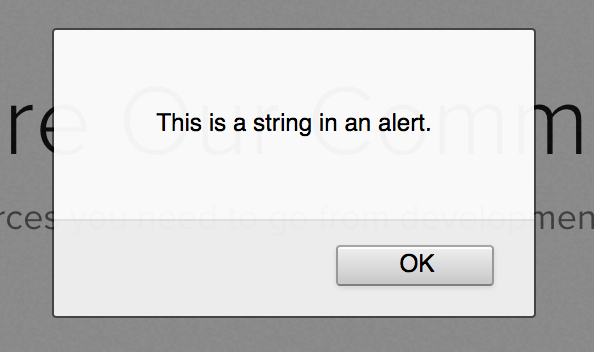

# Cómo Trabajar con Cadenas en JavaScript

:::info
La fuente original (en ingles) de este tutorial se encuentra [aquí](https://www.digitalocean.com/community/tutorials/how-to-work-with-strings-in-javascript)
:::

## Introducción

Una cadena es una secuencia de uno o más caracteres que pueden consistir en letras, números o símbolos. Las cadenas en JavaScript son [tipos de datos](./understanding-data-types.html#strings) primitivos e inmutables, lo que significa que no cambian.

Como las cadenas son la forma en que mostramos y trabajamos con el texto, y el texto es nuestra principal forma de comunicarnos y comprender a través de las computadoras, las cadenas son uno de los conceptos de programación más fundamentales con los que debemos estar familiarizados.

En este artículo, aprenderemos cómo crear y ver la salida de cadenas, cómo concatenar cadenas, cómo almacenar cadenas en variables y las reglas de uso de comillas, apóstrofos y nuevas líneas dentro de cadenas en JavaScript.

## Crear y Ver la Salida de Cadenas

En JavaScript, hay tres formas de escribir una cadena: se pueden escribir entre comillas simples (`' '`), comillas dobles (`" "`) o comillas invertidas (<code>\` \`</code>). El tipo de comilla utilizada debe coincidir en ambos lados; sin embargo, es posible que los tres estilos se puedan usar en el mismo script.

Las cadenas que utilizan comillas dobles y comillas simples son efectivamente las mismas. Como no existe ninguna convención ni preferencia oficial por las cadenas entre comillas simples o dobles, lo único que importa es mantener la coherencia dentro de los archivos de programa del proyecto.

```js
'This string uses single quotes.';
```

```js
"This string uses double quotes.";
```

La tercera y más nueva forma de crear una cadena se llama **literal de plantilla**. Los literales de plantilla usan la comilla invertida (también conocida como acento grave) y funcionan de la misma manera que las cadenas normales con algunas ventajas adicionales, que cubriremos en este artículo.

```js
`This string uses backticks.`;
```

La forma más sencilla de ver el resultado de una cadena es imprimirla en la consola, con `console.log()`:

```js
console.log("This is a string in the console.");
```

```sh
Output
This is a string in the console.
```

Otra forma sencilla de generar un valor es enviar una ventana emergente de alerta al navegador con `alert()`:

```js
alert("This is a string in an alert.");
```

Al ejecutar la línea anterior se producirá el siguiente resultado en la interfaz de usuario del navegador:



`alert()` es un método menos común para probar y ver resultados, ya que cerrar las alertas puede volverse tedioso rápidamente.

## Almacenar una Cadena en una Variable

Las variables en JavaScript son contenedores con nombre que almacenan un valor, utilizando las palabras clave `var`, `const` o `let`. Podemos asignar el valor de una cadena a una variable con nombre.

```js
const newString = "This is a string assigned to a variable.";
```

Ahora que la variable `newString` contiene nuestra cadena, podemos hacer referencia a ella e imprimirla en la consola.

```js
console.log(newString);
```

Esto generará el valor de la cadena.

```sh
Output
This is a string assigned to a variable.
```

Al usar variables para sustituir cadenas, no tenemos que volver a escribir una cadena cada vez que queremos usarla, lo que nos facilita trabajar y manipular cadenas dentro de nuestros programas.

## Concatenación de Cadenas

La **concatenación** significa unir dos o más cadenas para crear una nueva cadena. Para concatenar utilizamos el operador de concatenación, representado por un símbolo `+`. El símbolo `+` también es el [operador de suma](./how-to-do-math-in-javascript-with-operators.html#adicion-y-sustraccion) cuando se usa con operaciones aritméticas.

Creemos una instancia simple de concatenación, entre `"Sea"` y `"horse"`.

```js
"Sea" + "horse";
```

```sh
Output
Seahorse
```

Unimos cadenas y variables que contienen valores de cadena con concatenación.

```js
const poem = "The Wide Ocean";
const author = "Pablo Neruda";

const favePoem = "My favorite poem is " + poem + " by " + author + ".";
```

```sh
Output
My favorite poem is The Wide Ocean by Pablo Neruda.
```

Cuando combinamos dos o más cadenas mediante concatenación estamos creando una nueva cadena que podemos usar en todo nuestro programa.


## Variables en Cadenas con Literales de Plantilla

