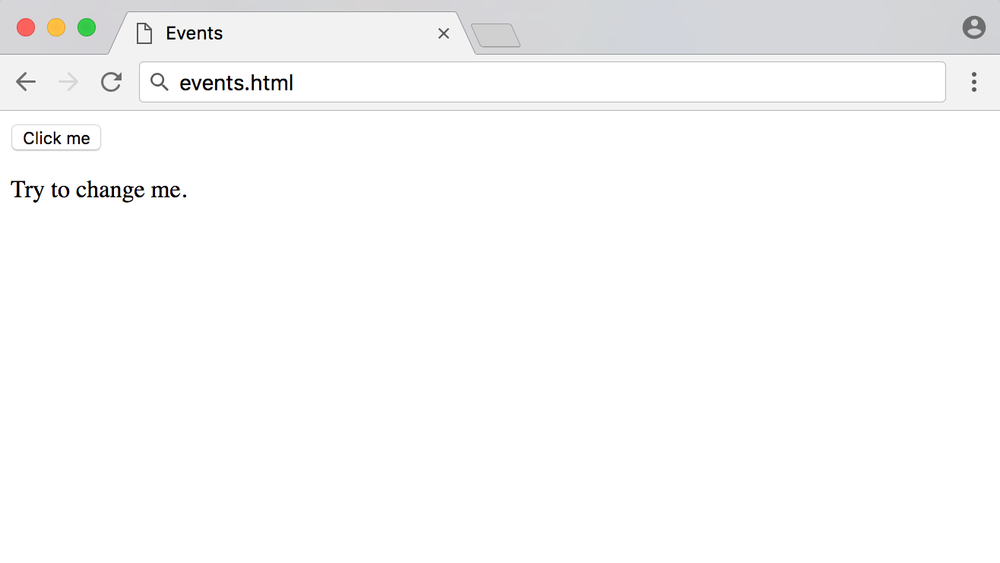
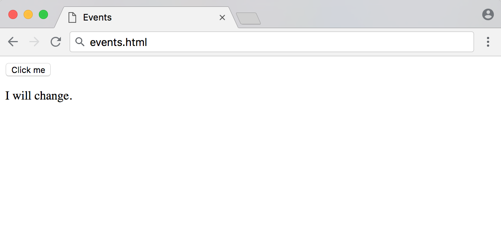

# Comprender Eventos en JavaScript

:::info
La fuente original (en ingles) de este tutorial se encuentra [aquí](https://www.digitalocean.com/community/tutorials/understanding-events-in-javascript)
:::


## Introducción

En la serie [Comprensión del DOM](https://ecanquiz.github.io/understanding-the-dom/), analizamos [el árbol DOM](https://ecanquiz.github.io/understanding-the-dom/understanding-the-dom-tree-and-nodes.html) y cómo [acceder](https://ecanquiz.github.io/understanding-the-dom/how-to-access-elements-in-the-dom.html), [recorrer](https://ecanquiz.github.io/understanding-the-dom/how-to-traverse-the-dom.html), [agregar, eliminar](https://ecanquiz.github.io/understanding-the-dom/how-to-make-changes-to-the-dom.html) y [modificar](https://ecanquiz.github.io/understanding-the-dom/how-to-modify-attributes-classes-and-styles-in-the-dom.html) nodos y elementos mediante la [Consola de Herramientas de Desarrollador](./how-to-use-the-js-dev-console.html).

Aunque en este punto ahora podemos realizar casi cualquier cambio que queramos en el DOM, desde la perspectiva del usuario no es muy útil porque solo hemos activado los cambios manualmente. Al aprender sobre eventos, entenderemos cómo unir todo para crear sitios web interactivos.

Los **eventos** son acciones que tienen lugar en el navegador y que pueden ser iniciadas por el usuario o por el propio navegador. A continuación se muestran algunos ejemplos de eventos comunes que pueden ocurrir en un sitio web:

- La página termina de cargarse.
- El usuario hace clic en un botón.
- El usuario pasa el cursor sobre un menú desplegable.
- El usuario envía un formulario.
- El usuario presiona una tecla en su teclado.

Al codificar respuestas de JavaScript que se ejecutan ante un evento, los desarrolladores pueden mostrar mensajes a los usuarios, validar datos, reaccionar al clic de un botón y muchas otras acciones.

En este artículo, repasaremos los controladores de eventos, los detectores de eventos y los objetos de eventos. También repasaremos tres formas diferentes de escribir código para manejar eventos y algunos de los eventos más comunes. Al conocer los eventos, podrá crear una experiencia web más interactiva para los usuarios finales.

## Manejadores de Eventos y Detector de Eventos

Cuando un usuario hace clic en un botón o presiona una tecla, se activa un evento. Estos se denominan eventos de clic o eventos de pulsación de tecla, respectivamente.

Un **manejador de eventos** es una función de JavaScript que se ejecuta cuando se activa un evento.

Un **detector de eventos** adjunta una interfaz receptiva a un elemento, lo que permite que ese elemento en particular espere y "detecte" hasta que se active el evento determinado.

Hay tres formas de asignar eventos a elementos:

- Manejadores de eventos en línea
- Propiedades del manejador de eventos
- Detectores de eventos

Repasaremos los tres métodos para asegurarnos de que esté familiarizado con cada forma en que se puede desencadenar un evento y luego discutiremos los pros y los contras de cada método.

### Atributos del Manejador de Eventos en Línea

Para comenzar a aprender sobre los manejadores de eventos, primero consideraremos el **manejador de eventos en línea**. Comencemos con un ejemplo muy básico que consta de un elemento `button` y un elemento `p`. Queremos que el usuario haga clic en el `button` para cambiar el contenido del texto de la `p`.

Comencemos con una página HTML con un botón en el _body_. Haremos referencia a un archivo JavaScript al que agregaremos código en un momento.


📃`events.html`
```html
<!DOCTYPE html>
<html lang="en-US">

<head>
	<title>Events</title>
</head>

<body>

  <!-- Add button -->
  <button>Click me</button>

  <p>Try to change me.</p>

</body>

<!-- Reference JavaScript file -->
<script src="js/events.js"></script>

</html>
```

Directamente en el `button`, agregaremos un atributo llamado `onclick`. El valor del atributo será una función que creamos llamada `changeText()`.


📃`events.html`
```html
<!DOCTYPE html>
<html lang="en-US">

<head>
	<title>Events</title>
</head>

<body>

	<button onclick="changeText()">Click me</button>

	<p>Try to change me.</p>

</body>

<script src="js/events.js"></script>

</html>
```

Creemos nuestro archivo `events.js`, que colocamos aquí en el directorio `js/`. Dentro de él, crearemos la función `changeText()`, que modificará el `textContent` del elemento `p`.


📃`js/events.js`
```js
// Function to modify the text content of the paragraph
const changeText = () => {
	const p = document.querySelector('p');

	p.textContent = "I changed because of an inline event handler.";
}
```

Cuando cargues `events.html` por primera vez, verás una página similar a esta:





Sin embargo, cuando usted u otro usuario hacen clic en el botón, el texto de la etiqueta `p` cambiará de `Try to change me.`  a `I changed because of an inline event handler.`:


Los manejadores de eventos en línea son una forma sencilla de comenzar a comprender los eventos, pero generalmente no deben usarse más allá de fines educativos y de prueba.


Puede comparar manejadores de eventos en línea con estilos CSS en línea en un elemento HTML. Es mucho más práctico mantener una hoja de estilos de clases separada que crear estilos en línea en cada elemento, del mismo modo que es más factible mantener JavaScript que se maneja completamente a través de un archivo de script separado que agregar manejadores a cada elemento.

### Propiedades del Manejador de Eventos

El siguiente paso desde un manejador de eventos en línea es la **propiedad del manejador de eventos**. Esto funciona de manera muy similar a un manejador en línea, excepto que configuramos la propiedad de un elemento en JavaScript en lugar del atributo en HTML.

La configuración será la misma aquí, excepto que ya no incluimos `onclick="changeText()"` en el marcado:


📃`events.html`
```html
<body>

	<button>Click me</button>

	<p>I will change.</p>

</body>
```


Nuestra función también seguirá siendo similar, excepto que ahora necesitamos acceder al elemento del `button` en JavaScript. Simplemente podemos acceder al `onclick` tal como accederíamos al `style` o `id` o cualquier otra propiedad de elemento, luego asignar la referencia de la función.


📃`js/events.js`
```js
// Function to modify the text content of the paragraph
const changeText = () => {
	const p = document.querySelector('p');

	p.textContent = "I changed because of an event handler property.";
}

// Add event handler as a property of the button element
const button = document.querySelector('button');
button.onclick = changeText;
```

:::info Nota
Los manejadores de eventos no siguen la convención _camelCase_ a la que se adhiere la mayoría del código JavaScript. Observe que el código es `onclick`, no `onClick`.
:::

Cuando cargue la página por primera vez, el navegador mostrará lo siguiente:



Ahora, cuando hagas clic en el botón, tendrá un efecto similar al anterior:


Tenga en cuenta que al pasar una referencia de función a la propiedad `onclick`, no incluimos paréntesis, ya que no estamos invocando la función en ese momento, sino que solo le pasamos una referencia.


La propiedad del manejador de eventos es un poco más fácil de mantener que el manejador en línea, pero aún sufre algunos de los mismos obstáculos. Por ejemplo, intentar establecer varias propiedades `onclick` separadas provocará que todas menos la última se sobrescriban, como se demuestra a continuación.


📃`js/events.js`
```js
const p = document.querySelector('p');
const button = document.querySelector('button');

const changeText = () => {
	p.textContent = "Will I change?";
}

const alertText = () => {
	alert('Will I alert?');
}

// Events can be overwritten
button.onclick = changeText;
button.onclick = alertText;
```

En el ejemplo anterior, hacer clic en el `button` solo mostraría una alerta y no cambiaría el texto `p`, ya que el código `alert()` fue el último agregado a la propiedad.


Una vez que comprendamos tanto los manejadores de eventos en línea como las propiedades del manejador de eventos, pasemos a los detectores de eventos.


### Detectores de Eventos

La última incorporación a los manejadores de eventos de JavaScript son los detectores de eventos. Un **detector de eventos** busca un evento en un elemento. En lugar de asignar el evento directamente a una propiedad del elemento, usaremos el método `addEventListener()` para escuchar el evento.

`addEventListener()` toma dos parámetros obligatorios: el evento que se va a escuchar y la función de devolución de llamada del detector.


El HTML de nuestro detector de eventos será el mismo que el del ejemplo anterior.


📃`events.html`
```html
...
	<button>Click me</button>

	<p>I will change.</p>
...
```

Seguiremos usando la misma función `changeText()` que antes. Adjuntaremos el método `addEventListener()` al botón.


📃`js/events.js`
```js
// Function to modify the text content of the paragraph
const changeText = () => {
	const p = document.querySelector('p');

	p.textContent = "I changed because of an event listener.";
}

// Listen for click event
const button = document.querySelector('button');
button.addEventListener('click', changeText);
```

Tenga en cuenta que con los dos primeros métodos, un evento de clic se denominaba `onclick`, pero con los detectores de eventos se denomina `click`. Cada detector de eventos elimina la palabra `on`. En la siguiente sección, veremos más ejemplos de otros tipos de eventos.

Cuando recargas la página con el código JavaScript anterior, recibirás el siguiente resultado:


A primera vista, los detectores de eventos parecen muy similares a las propiedades del manejador de eventos, pero tienen algunas ventajas. Podemos configurar varios detectores de eventos en el mismo elemento, como se demuestra en el siguiente ejemplo.


📃`js/events.js`
```js
const p = document.querySelector('p');
const button = document.querySelector('button');

const changeText = () => {
	p.textContent = "Will I change?";
}

const alertText = () => {
	alert('Will I alert?');
}

// Multiple listeners can be added to the same event and element
button.addEventListener('click', changeText);
button.addEventListener('click', alertText);
```


En este ejemplo, ambos eventos se activarán y proporcionarán al usuario una alerta y un texto modificado una vez que haga clic para salir de la alerta.


A menudo, se utilizarán funciones anónimas en lugar de una referencia de función en un detector de eventos. Las funciones anónimas son funciones que no tienen nombre.


```js
// An anonymous function on an event listener
button.addEventListener('click', () => {
	p.textContent = "Will I change?";
});
```


También es posible utilizar la función `removeEventListener()` para eliminar uno o todos los eventos de un elemento.


```js
// Remove alert function from button element
button.removeEventListener('click', alertText);
```


Además, puede utilizar `addEventListener()` en el `document` y el objeto `window`.


Los detectores de eventos son actualmente la forma más común y preferida de manejar eventos en JavaScript.


## Common Events
