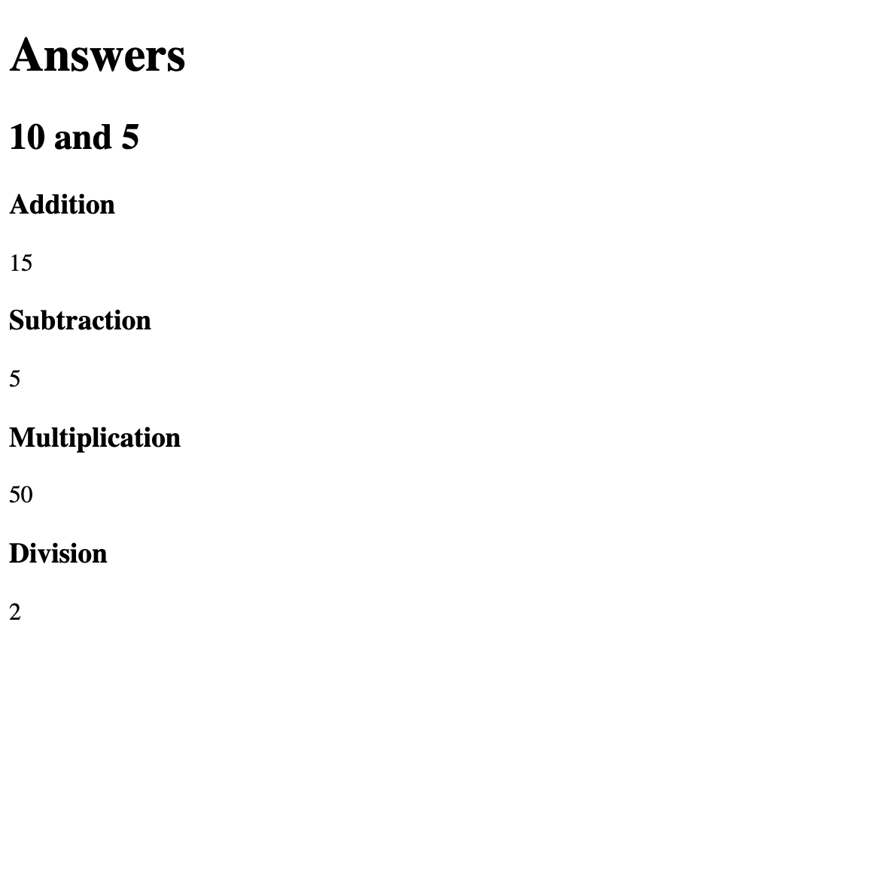

# Comprender Módulos y Declaraciones de Importación y Exportación en JavaScript

:::info
La fuente original (en ingles) de este tutorial se encuentra [aquí](https://www.digitalocean.com/community/tutorials/understanding-modules-and-import-and-export-statements-in-javascript)
:::

## Introducción

En los primeros tiempos de la Web, los sitios web consistían principalmente en [HTML](https://www.digitalocean.com/community/tutorial-series/how-to-build-a-website-with-html) y [CSS](https://www.digitalocean.com/community/tutorial-series/how-to-build-a-website-with-css). Si se cargaba JavaScript en una página, normalmente era en forma de pequeños fragmentos que proporcionaban efectos e interactividad. Como resultado, los programas JavaScript solían escribirse íntegramente en un archivo y cargarse en una etiqueta `script`. Un desarrollador podía dividir el JavaScript en varios archivos, pero todas las variables y [funciones](./how-to-define-functions-in-javascript.html) se seguían añadiendo al [alcance](./understanding-variables-scope-and-hoisting.html) global.

Pero a medida que los sitios web han evolucionado con la llegada de marcos como [Angular](https://www.digitalocean.com/community/tags/angularjs), [React](https://www.digitalocean.com/community/tutorial-series/how-to-code-in-react-js) y [Vue](https://www.digitalocean.com/community/tags/vue-js), y con las empresas que crean aplicaciones web avanzadas en lugar de aplicaciones de escritorio, JavaScript ahora desempeña un papel importante en el navegador. Como resultado, existe una necesidad mucho mayor de utilizar código de terceros para tareas comunes, para dividir el código en archivos modulares y para evitar contaminar el espacio de nombres global.

La especificación [ECMAScript 2015](https://262.ecma-international.org/6.0/) introdujo _módulos_ al lenguaje JavaScript, lo que permitió el uso de declaraciones `import` y `export`. En este tutorial, aprenderá qué es un módulo de JavaScript y cómo usar `import` y `export` para organizar su código.

## Programación Modular

Antes de que apareciera el concepto de módulos en JavaScript, cuando un desarrollador quería organizar su código en segmentos, creaba varios archivos y los vinculaba como scripts separados. Para demostrar esto, cree un archivo `index.html` de ejemplo y dos archivos JavaScript, `functions.js` y `script.js`.

El archivo `index.html` mostrará la suma, la diferencia, el producto y el cociente de dos números, y se vinculará a los dos archivos JavaScript en las etiquetas `script`. Abra `index.html` en un editor de texto y agregue el siguiente código:


📃`index.html`
```html
<!DOCTYPE html>
<html lang="en">
  <head>
    <meta charset="utf-8" />
    <meta name="viewport" content="width=device-width, initial-scale=1.0" />

    <title>JavaScript Modules</title>
  </head>

  <body>
    <h1>Answers</h1>
    <h2><strong id="x"></strong> and <strong id="y"></strong></h2>

    <h3>Addition</h3>
    <p id="addition"></p>

    <h3>Subtraction</h3>
    <p id="subtraction"></p>

    <h3>Multiplication</h3>
    <p id="multiplication"></p>

    <h3>Division</h3>
    <p id="division"></p>

    <script src="functions.js"></script>
    <script src="script.js"></script>
  </body>
</html>
```

Este HTML mostrará el valor de las variables `x` e `y` en un encabezado `h2`, y el valor de las operaciones sobre esas variables en los siguientes elementos `p`. Los atributos `id` de los elementos se configuran para la [manipulación del DOM](https://ecanquiz.github.io/understanding-the-dom/), que se realizará en el archivo `script.js`; este archivo también configurará los valores de `x` e `y`. Para obtener más información sobre HTML, consulte la serie [Cómo Crear un Sitio Web con HTML](https://www.digitalocean.com/community/tutorial-series/how-to-build-a-website-with-html).

El archivo `functions.js` contendrá las funciones matemáticas que se utilizarán en el segundo script. Abra el archivo `functions.js` y agregue lo siguiente:


📃`functions.js`
```js
function sum(x, y) {
  return x + y
}

function difference(x, y) {
  return x - y
}

function product(x, y) {
  return x * y
}

function quotient(x, y) {
  return x / y
}
```

Finalmente, el archivo `script.js` determinará los valores de `x` e `y`, les aplicará las funciones y mostrará el resultado:


📃`script.js`
```js
const x = 10
const y = 5

document.getElementById('x').textContent = x
document.getElementById('y').textContent = y

document.getElementById('addition').textContent = sum(x, y)
document.getElementById('subtraction').textContent = difference(x, y)
document.getElementById('multiplication').textContent = product(x, y)
document.getElementById('division').textContent = quotient(x, y)
```

Después de configurar estos archivos y guardarlos, puede [abrir `index.html` en un navegador](https://www.digitalocean.com/community/tutorials/how-to-use-and-understand-html-elements#how-to-view-an-offline-html-file-in-your-browser) para mostrar su sitio web con todos los resultados:




Para sitios web con unos pocos scripts pequeños, esta es una forma eficaz de dividir el código. Sin embargo, este enfoque conlleva algunos problemas, entre ellos:


- **Contaminación del espacio de nombres global**: todas las variables que creaste en tus scripts — `sum`, `difference`, etc. — ahora existen en el objeto [`window`](https://developer.mozilla.org/en-US/docs/Web/API/Window). Si intentaras usar otra variable llamada `sum` en otro archivo, sería difícil saber qué valor se usaría en cualquier punto de los scripts, ya que todos usarían la misma variable `window.sum`. La única forma en que una variable podría ser privada era colocándola dentro del ámbito de una función. Incluso podría haber un conflicto entre un `id` en el DOM llamado `x` y `var x`.
- **Gestión de dependencias**: los scripts tendrían que cargarse en orden de arriba hacia abajo para garantizar que las variables correctas estuvieran disponibles. Guardar los scripts como archivos diferentes da la ilusión de separación, pero es esencialmente lo mismo que tener un solo `<script>` en línea en la página del navegador.


Antes de que ES6 añadiera módulos nativos al lenguaje JavaScript, la comunidad intentó encontrar varias soluciones. Las primeras soluciones se escribieron en JavaScript puro, como escribir todo el código en [objetos](./understanding-objects-in-javascript.html) o [expresiones de función invocadas inmediatamente (IIFE)](https://developer.mozilla.org/en-US/docs/Glossary/IIFE) y colocarlas en un único objeto en el espacio de nombres global. Esto supuso una mejora con respecto al enfoque de scripts múltiples, pero seguía teniendo los mismos problemas de poner al menos un objeto en el espacio de nombres global y no facilitaba el problema de compartir código de forma constante entre terceros.

Después de eso, surgieron algunas soluciones de módulos: [CommonJS](https://en.wikipedia.org/wiki/CommonJS), un enfoque sincrónico que se implementó en [Node.js](https://www.digitalocean.com/community/tutorial-series/how-to-code-in-node-js), [Asynchronous Module Definition (AMD)](https://en.wikipedia.org/wiki/Asynchronous_module_definition), que era un enfoque asincrónico, y [Universal Module Definition (UMD)](https://github.com/umdjs/umd), que pretendía ser un enfoque universal que admitiera ambos estilos anteriores.

La aparición de estas soluciones facilitó a los desarrolladores compartir y reutilizar código en forma de _paquetes_, módulos que se pueden distribuir y compartir, como los que se encuentran en [npm](https://www.npmjs.com/). Sin embargo, como había muchas soluciones y ninguna era nativa de JavaScript, se tuvieron que implementar herramientas como [Babel](https://babeljs.io/), [Webpack](https://webpack.js.org/) o [Browserify](https://browserify.org/) para usar módulos en los navegadores.

Debido a los muchos problemas con el enfoque de archivos múltiples y la complejidad de las soluciones propuestas, los desarrolladores estaban interesados ​​en llevar el enfoque de [programación modular](https://en.wikipedia.org/wiki/Modular_programming) al lenguaje JavaScript. Debido a esto, ECMAScript 2015 admite el uso de módulos JavaScript.

Un _módulo_ es un conjunto de código que actúa como una interfaz para proporcionar funcionalidad para que otros módulos la utilicen, además de poder confiar en la funcionalidad de otros módulos. Un módulo _exporta_ para proporcionar código e _importa_ para usar otro código. Los módulos son útiles porque permiten a los desarrolladores reutilizar el código, proporcionan una interfaz estable y consistente que muchos desarrolladores pueden usar y no contaminan el espacio de nombres global.

Los módulos (a veces denominados módulos ECMAScript o módulos ES) ahora están disponibles de forma nativa en JavaScript y, en el resto de este tutorial, explorará cómo usarlos e implementarlos en su código.

## Módulos nativos de JavaScript

Los módulos en JavaScript utilizan las palabras clave `import` y `export`:

- `import`: Utilizado para leer el código exportado desde otro módulo.
- `export`: Utilizado para proporcionar código a otros módulos.

Para demostrar cómo utilizar esto, actualice su archivo `functions.js` para que sea un módulo y exporte las funciones. Agregará `export` delante de cada función, lo que las hará disponibles para cualquier otro módulo.

Agregue el siguiente código resaltado a su archivo:

📃`functions.js`
```js{1,5,9,13}
export function sum(x, y) {
  return x + y
}

export function difference(x, y) {
  return x - y
}

export function product(x, y) {
  return x * y
}

export function quotient(x, y) {
  return x / y
}
```

Ahora, en `script.js`, usará `import` para recuperar el código del módulo `functions.js` en la parte superior del archivo.

:::info Nota
`import` siempre debe estar en la parte superior del archivo antes de cualquier otro código, y también es necesario incluir la ruta relativa (`./` en este caso).
:::


Agregue el siguiente código resaltado a `script.js`:


📃`script.js`
```js{1}
import { sum, difference, product, quotient } from './functions.js'

const x = 10
const y = 5

document.getElementById('x').textContent = x
document.getElementById('y').textContent = y

document.getElementById('addition').textContent = sum(x, y)
document.getElementById('subtraction').textContent = difference(x, y)
document.getElementById('multiplication').textContent = product(x, y)
document.getElementById('division').textContent = quotient(x, y)
```

Tenga en cuenta que las funciones individuales se importan nombrándolas entre llaves.

Para garantizar que este código se cargue como un módulo y no como un script normal, agregue `type="module"` a las etiquetas `script` en `index.html`. Cualquier código que use `import` o `export` debe usar este atributo:


📃`index.html`
```html
...
<script type="module" src="functions.js"></script>
<script type="module" src="script.js"></script>
```

En este punto, podrá volver a cargar la página con las actualizaciones y el sitio web utilizará módulos. La compatibilidad con navegadores es muy alta, pero [caniuse](https://caniuse.com/?search=modules) está disponible para verificar qué navegadores la admiten. Tenga en cuenta que si está viendo el archivo como un enlace directo a un archivo local, encontrará este error:


```sh
Output
Access to script at 'file:///Users/your_file_path/script.js' from origin 'null' has been blocked by CORS policy: Cross-origin requests are only supported for protocol schemes: http, data, chrome, chrome-extension, chrome-untrusted, https.
```


Debido a la [política CORS](https://en.wikipedia.org/wiki/Cross-origin_resource_sharing), los módulos se deben utilizar en un entorno de servidor, que puede configurar localmente con [http-server](https://www.npmjs.com/package/http-server) o en Internet con un proveedor de alojamiento.

Los módulos se diferencian de los scripts normales en algunos aspectos:

- Los módulos no agregan nada al alcance global (`window`).
- Los módulos siempre están en [modo estricto](https://developer.mozilla.org/en-US/docs/Web/JavaScript/Reference/Strict_mode).
- Cargar el mismo módulo dos veces en el mismo archivo no tendrá ningún efecto, ya que los módulos solo se ejecutan una vez.
- Los módulos requieren un entorno de servidor.

Los módulos todavía se utilizan a menudo junto con empaquetadores como Webpack para una mayor compatibilidad con navegadores y funciones adicionales, pero también están disponibles para su uso directo en navegadores.

A continuación, explorará algunas formas más en las que se puede utilizar la sintaxis `import` y `export`.

## Exportaciones Nombradas

Como se demostró anteriormente, el uso de la sintaxis `export` le permitirá importar individualmente valores que se han exportado por su nombre. Por ejemplo, tome esta versión simplificada de `functions.js`:


📃`functions.js`
```js
export function sum() {}
export function difference() {}
```

Esto le permitirá importar `sum` y `difference` por nombre usando llaves:


📃`script.js`
```js
import { sum, difference } from './functions.js'
```

También es posible utilizar un alias para cambiar el nombre de la función. Puede hacerlo para evitar conflictos de nombres dentro del mismo módulo. En este ejemplo, `sum` se renombrará a `add` y `difference` se renombrará a `subtract`.


📃`script.js`
```js
import {
  sum as add,
  difference as subtract
} from './functions.js'

add(1, 2) // 3
```

Llamar a `add()` aquí producirá el resultado de la función `sum()`.

Con la sintaxis `*`, puede importar el contenido de todo el módulo en un solo objeto. En este caso, `sum` y `difference` se convertirán en métodos del objeto `mathFunctions`.


📃`script.js`
```js
import * as mathFunctions from './functions.js'

mathFunctions.sum(1, 2) // 3
mathFunctions.difference(10, 3) // 7
```

Se pueden exportar valores primitivos, expresiones y definiciones de funciones, [funciones asincrónicas](./understanding-the-event-loop-callbacks-promises-and-async-await-in-javascript.html#funciones-asincronicas-con-async-await), [clases](./understanding-classes-in-javascript.html) y clases instanciadas, siempre que tengan un identificador:


```js
// Primitive values
export const number = 100
export const string = 'string'
export const undef = undefined
export const empty = null
export const obj = { name: 'Homer' }
export const array = ['Bart', 'Lisa', 'Maggie']

// Function expression
export const sum = (x, y) => x + y

// Function definition
export function difference(x, y) {
  return x - y
}

// Asynchronous function
export async function getBooks() {}

// Class
export class Book {
  constructor(name, author) {
    this.name = name
    this.author = author
  }
}

// Instantiated class
export const book = new Book('Lord of the Rings', 'J. R. R. Tolkien')
```

Todas estas exportaciones se pueden importar correctamente. El otro tipo de exportación que explorará en la siguiente sección se conoce como exportación predeterminada.


## Exportaciones Predeterminadas

En los ejemplos anteriores, exportó varias exportaciones nombradas y las importó de forma individual o como un objeto con cada exportación como método en el objeto. Los módulos también pueden contener una exportación predeterminada, utilizando la palabra clave `default`. Una exportación predeterminada no se importará con llaves, sino que se importará directamente en un identificador nombrado.

Por ejemplo, tome el siguiente contenido para el archivo `functions.js`:

📃`functions.js`
```js
export default function sum(x, y) {
  return x + y
}
```


En el archivo `script.js`, puedes importar la función predeterminada como `sum` con lo siguiente:


📃`script.js`
```js
import sum from './functions.js'

sum(1, 2) // 3
```


Esto puede ser peligroso, ya que no existen restricciones sobre el nombre que se le puede dar a una exportación predeterminada durante la importación. En este ejemplo, la función predeterminada se importa como `difference`, aunque en realidad es la función `sum`:


📃`script.js`
```js
import difference from './functions.js'

difference(1, 2) // 3
```

Por este motivo, a menudo se prefiere utilizar exportaciones nombradas. A diferencia de las exportaciones nombradas, las exportaciones predeterminadas no requieren un identificador — se puede utilizar un valor primitivo por sí solo o una función anónima como exportación predeterminada. A continuación, se muestra un ejemplo de un objeto utilizado como exportación predeterminada:


📃`functions.js`
```js
export default {
  name: 'Lord of the Rings',
  author: 'J. R. R. Tolkien',
}
```


Podrías importarlo como `book` con lo siguiente:


📃`script.js`
```js
import book from './functions.js'
```

De manera similar, el siguiente ejemplo demuestra cómo exportar una [función de flecha](./understanding-arrow-functions-in-javascript.html) anónima como exportación predeterminada:


📃`functions.js`
```js
export default () => 'This function is anonymous'
```

Esto se puede importar con el siguiente `script.js`:

📃`script.js`
```js
import anonymousFunction from './functions.js'
```

Las exportaciones nombradas y las exportaciones predeterminadas se pueden usar juntas, como en este módulo que exporta dos valores nombrados y un valor predeterminado:


📃`functions.js`
```js
export const length = 10
export const width = 5

export default function perimeter(x, y) {
  return 2 * (x + y)
}
```

Puede importar estas variables y la función predeterminada con lo siguiente:


📃`script.js`
```js
import calculatePerimeter, { length, width } from './functions.js'

calculatePerimeter(length, width) // 30
```

Ahora, tanto el valor predeterminado como los valores nombrados están disponibles para el script.


## Conclusión

Las prácticas de diseño de programación modular le permiten separar el código en componentes individuales que pueden ayudar a que su código sea reutilizable y consistente, al mismo tiempo que protege el espacio de nombres global. Se puede implementar una interfaz de módulo en JavaScript nativo con las palabras clave `import` y `export`.

En este artículo, aprendiste sobre la historia de los módulos en JavaScript, cómo separar archivos JavaScript en múltiples scripts de nivel superior, cómo actualizar esos archivos usando un enfoque modular y la sintaxis `import` y `export` para exportaciones predeterminadas y con nombre.

Para obtener más información sobre módulos en JavaScript, lee [Módulos](https://developer.mozilla.org/en-US/docs/Web/JavaScript/Guide/Modules) en la Red de desarrolladores de Mozilla. Si quieres explorar los módulos en Node.js, prueba el tutorial [Cómo Crear un Módulo de Node.js](https://www.digitalocean.com/community/tutorials/how-to-create-a-node-js-module).

